## Milestone Project 3 

<h2 align="center">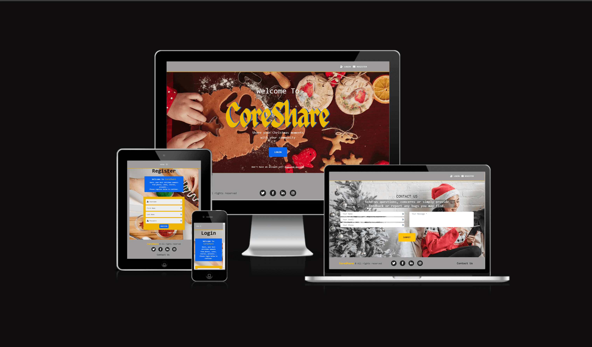</h2>

* CoreShare is a Christmas sharing website which allows users to post anything about their day, their food, good moments, etc. As well as view those submitted by other members. The website design is responsive so it can be used on any device.

* This is my Milestone Project 3 submission for Code Institute's Diploma in Web Application Development course. My website uses relational databases, features full CRUD functionality and is built using technologies that I have learnt including HTML, CSS, JavaScript, Python, Flask and PostgreSQL/ElephantSQL.

## Live Project

[View the live project here.]()

## Repository

[Find the project repository here.](https://github.com/Esmael-Pinho/Third-Milestone-Project)

# Table of Contents

## Contents
- [User experience](#user-experience)
  * [User Stories](#user-stories)
    + [First-time Users](#first-time-users)
    + [Returning Users](#returning-users)
    + [Business Owner](#business-owner)
- [Design](#design)
  + [Overview](#overview)
  + [Colour Scheme](#colour-scheme)
  + [Typography](#typography)
  + [Icons](#icons)
  + [Cards](#cards)
- [Wireframes](#wireframes)
- [Features](#features)
  + [All Pages Features](#all-pages-features)
    - [Navbar](#navbar)
    - [Footer](#footer)
  + [Register and Log In Pages](#register-and-log-in-pages)
- [Future Features](#future-features)
- [Data Model](#data-model)
- [Technologies used](#technologies-used)
  + [Languages Used](#languages-used)
  + [Frameworks Libraries and Programs](#frameworks-libraries-and-programs)
- [Testing](#testing)
- [Deployment](#deployment)
  + [Creating a Gitpod Workspace](#creating-a-gitpod-workspace)
  + [GitHub Pages](#github-pages)
  + [Forking the GitHub Repository](#forking-the-github-repository)
  + [Making a Local Clone](#making-a-local-clone)
  + [Creating an application with Heroku](#creating-an-application-with-heroku)
- [Credits](#credits)
  + [Code](#code)
  + [Media Content](#media-content)
  + [Acknowledgements](#acknowledgements)

# User Experience

## User stories

### First-time Users

* As a first-time user, I want the landing page of the website to explain the purpose of the website and allow me to preview the content.

* As a first-time user, I want to be able to register for an account.

* As a first-time user, I want the website to work on any device.

### Returning Users

* As a returning user, I want to be able to log in to my account.

* As a returning user, I want to be able to create/ view/ edit/ delete my own posts.

* As a returning user, I want to be able to view other user’s posts.


* As a returning user, I want recipes to include useful information such as a title, a description of what I intend and pictures is necessary. 


* As a returning user, I want to be able to access and use the website on any device.

### Business Owner

* As a business owner, I want users to be able to create, edit and delete their own posts, but not those of any other user.

* As a business owner, I want the adding, editing and deleting of posts to be limited to the person who added the post. 

* As a business owner, I want it to be as easy as possible for users to post anything they want.

* As a business owner, I want the website to function and look good on any device.

## Design

### Overview

- The website design is playful, colourful and youthful. The name ‘CoreShare’ refers to the website’s purpose as a way of sharing.
User can register and/or login. Users, can add a post by providing a name, description, they can provide a photo if they want want get to choose from the categories created.
On the home page, user can add new categories and/or view posts that have been created for specific categories. They can send the app owner a message, regarding any ideas to improvements, or buggs, and they can terminate their session, by logging out.

### Colour Scheme
A combination of very bright and primary color, to get a litle attencion.! 
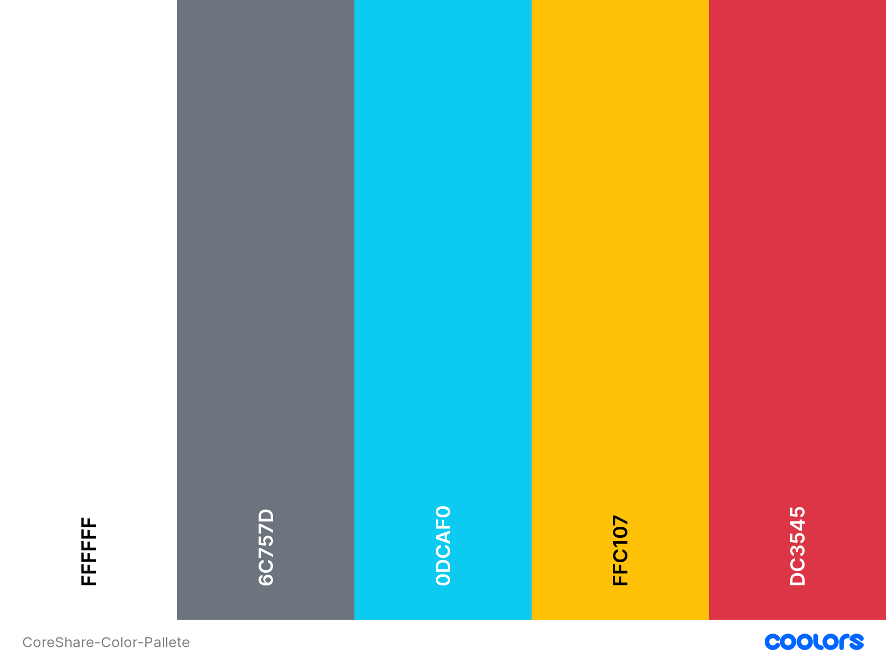

### Typography

 Google Fonts was used for the following fonts:
  * Bruno Ace Sc : was used for the logo at the navbar.
  * Ubuntu: was used for the headings
  * Oswald: was used for the paragraphs, small texts and spans.
  * Sans-serif: used as the fallback font.


### Icons

- [From Fontawesome](https://fontawesome.com/icons).

### Cards

- [Bootstrap cards](https://getbootstrap.com/docs/5.3/components/card/#card-groups)

# Wireframes

- [View my Home-Page wireframe](./coreshare/static/images/wireframes/Home-Page-wireframe.png).
- [View my Intro-Page wireframe](./coreshare/static/images/wireframes/Intro-Page.png).
- [View my Posts-Page wireframe](./coreshare/static/images/wireframes/Posts-Page-wireframe.png).
- [View my Contact-Page wireframe](./coreshare/static/images/wireframes/Contact-Page-wireframe.png).

# Features

## All Pages Features

### NavBar
Nav structure, simple, responsive, compose of an img logo, two nav links, if the user is not logged in, which after becomes four nav links, being those: Home, My Posts, Contact Us and logout.


### Footer 
Footer follows the same principle as the navbar, responsive on all screens, with three sections, the app name, some social links and contact button.

 

 ### Intro-Page
 The navbar has only two links, login and register. The page, as centered mid div, compose of the site name logo, a welcome, msg and login button to direct the user to the sign up page, as well as the footer at the bottom with a contact us link in case of some issues.
 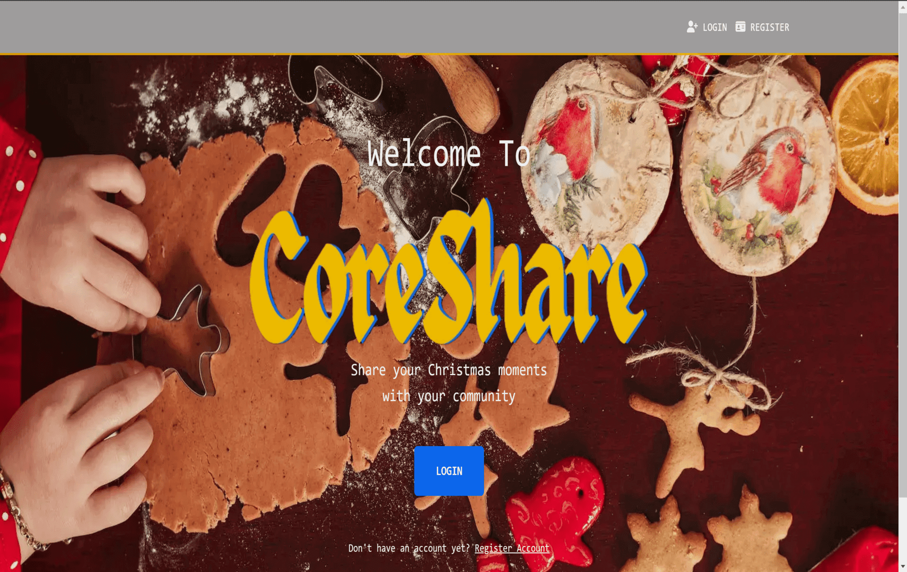


 ### Home-Page
 The home page, is where user can create categories, and those will display on the page,being clickable, and if clicked it opens up a modal where it will display the posts that were created for those specify categories.
 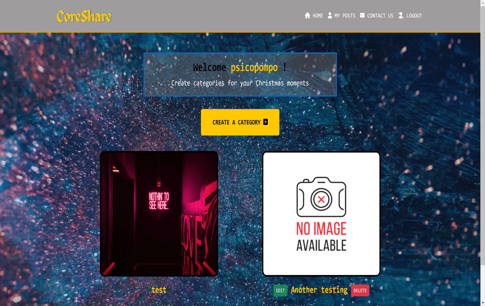
 The user can create categories, which requests a category name, and an image url, being the image optional, as a default on will be provided.
 <h2 align="center">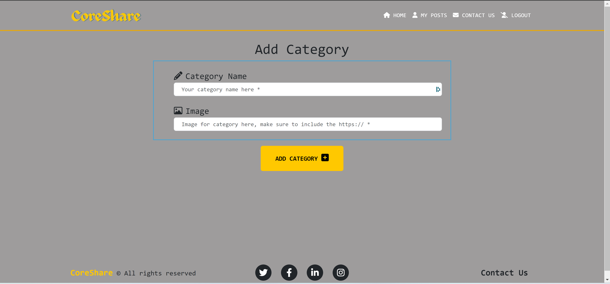</h2>


## Register and Log In Pages
- The Log in form features input fields for Username and Password. All fields are required.
<h2 align="center">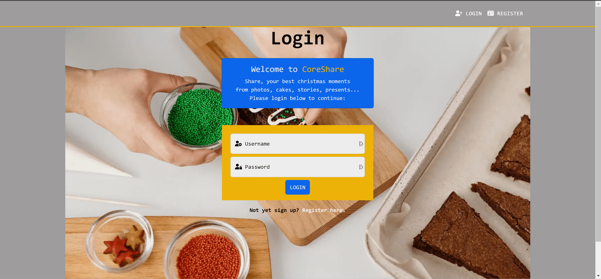</h2>
- The Register and Log in pages both feature forms, a login and register buttons, and a link to the other page incase a user is in the wrong place. E.g. on the Register Page, it says "Already Registered? Log in here."
<h2 align="center">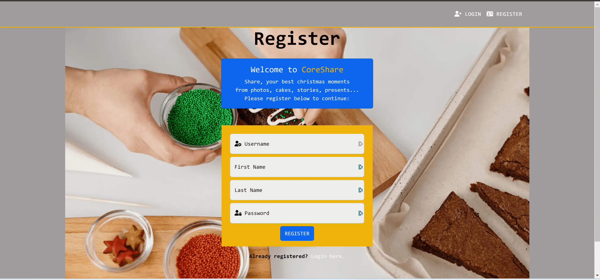</h2>
- The Register form features input fields for Username, First Name, Last Name and Password. All fields are required.


### My Posts
- The user Posts, has a simple intro message, with the their username displayed on top followed by the create posts button. If posts have been created the user will see them displaying through an accordion(from bootstrap) that allows for a collapse effect, toggling the effect will then display the post name, followed by the description and two buttons, one for editing the other for deleting.
<h2 align="center">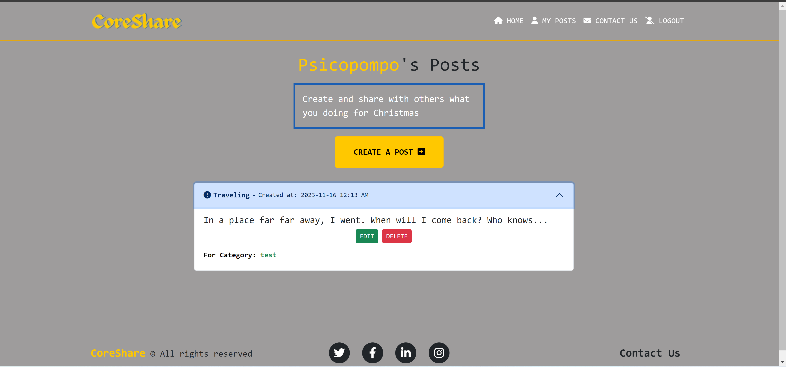</h2>
- Users can edit the post already created, the fields will be field from the previous post created making it easier to change something more specific.
<h2 align="center">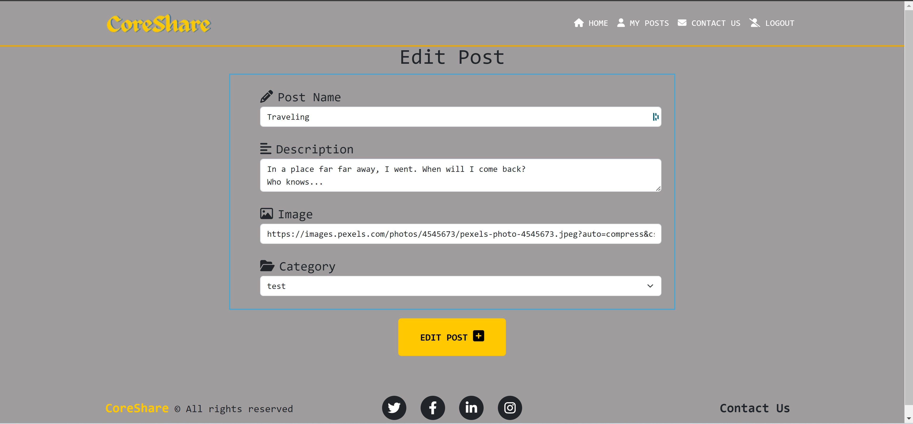</h2>


### Contact-Page
- Contact page to allow users to send a message, feedback, a comment, some ideas or complains,or simply a hello message, about the app. It has a form requiring a name, a textarea, for the subject, reason they are contacting. After the form submition, a thank you message will display.
<h2 align="center">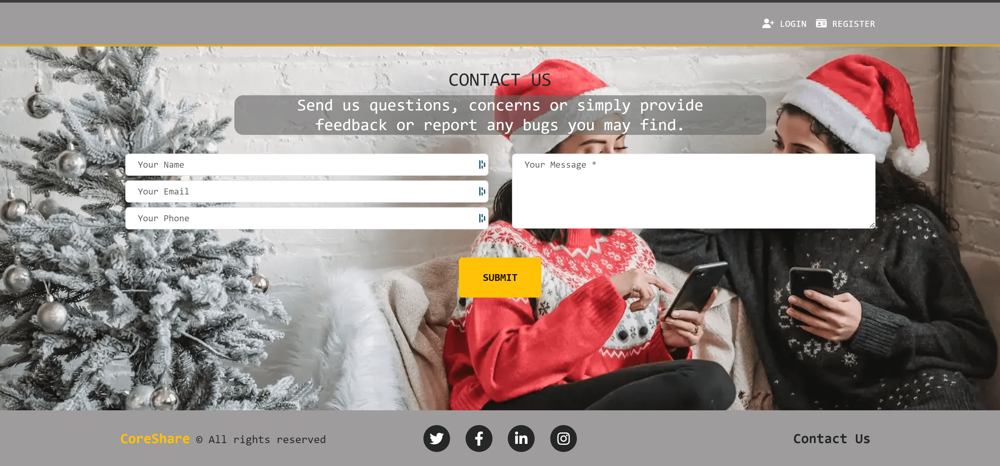</h2>
<h2 align="center">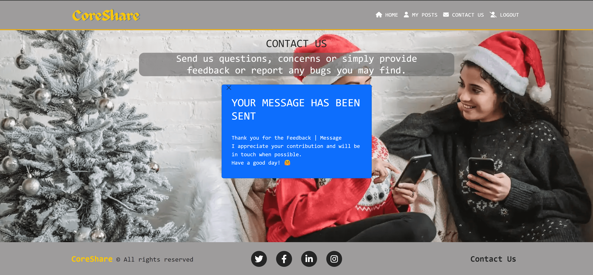</h2>

### Page-404 
- A page to direct user, in case an error, back to the main page, in order to try again, as that may solve the issue encountered.
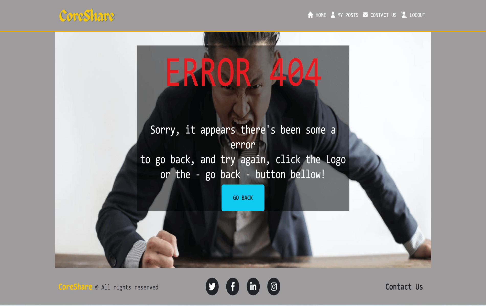

# Future Features
- In the future, I want to implement a small container on the navbar as well on "My Posts", so that the user may upload their photos, and provide them with flexibility, to style it to their own pleasing, as the page is very simple.
- I hope to implement a comment section, where user may  exchange ideas, comments in real time.
- Be able to also include videos, as per the site theme, there would be lot's of videos in need of sharing.
- Implemente a timer from when the user no longer active, to prevent user being always log in.


# Data Model

- [View my Database diagram structure here](./coreshare/static/images/readme/wireframes/app-diagram.png).

# Technologies Used

## Languages Used

- [HTML5](https://en.wikipedia.org/wiki/HTML5)

- [CSS3](https://en.wikipedia.org/wiki/CSS)

- [JavaScript](https://en.wikipedia.org/wiki/JavaScript)

- [Python](https://en.wikipedia.org/wiki/Python_(programming_language))

## Frameworks Libraries and Programs

- [Heroku](https://id.heroku.com/login)
  - Heroku is the deployment source I used for this project. I'm also using it for the Postgres relational database

- [Flask](https://flask.palletsprojects.com/en/2.2.x/templating/)
  - Templating language I've used with Python to add logic to my html templates.

- [Jinja](https://jinja.palletsprojects.com/en/3.0.x/)
  - Templating language I've used with Python to add logic to my html templates.

- [Materialize CSS](https://materializecss.com/)
  - Front-end library with HTML, CSS and Javascript based componants. I used features including Nav bar, Cards, Buttons and Forms.

- [jQuery](https://jquery.com/)
  - I used jQuery to add functionality to MaterialiseCSS.

- [Google Fonts](https://fonts.google.com/)
  - Two fonts are imported from google fonts.
  
- [Font awesome](https://fontawesome.com/)
  - I used icons from font awesome on buttons.

- [Git](https://git-scm.com/)
  - Git was used as a version control in the terminal.

- [Github](https://github.com/)
  - Github was used to create and store the project repository.

- [Gitpod](https://gitpod.io/)
  - Gitpod was used to create my files and where I wrote the code.

- [Balsamiq](https://balsamiq.com/)
  - Balsamiq was used to create Wireframes for the project during the initial planning stage.

- [TinyPNG](https://tinypng.com/)
  - TinyPNG was used to compress images for a faster loading time.

- [Google Chrome Dev Tools](https://developer.chrome.com/docs/devtools/)
  - Google Chrome's Dev Tools were used while building the project to test responsiveness and for debugging.

- [LucydChart](https://lucid.app/)
  - Tool used to mock up database structure diagram.

# Testing
### W3C Validator
 - Main pages 

| **Intro** | **Login** | **Register** | **Contact** | **Home** | **Posts** |
|-----------|-----------|--------------|-------------|----------|-----------|
| 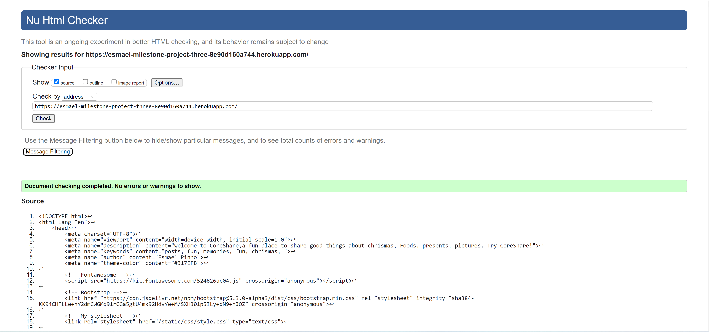 | 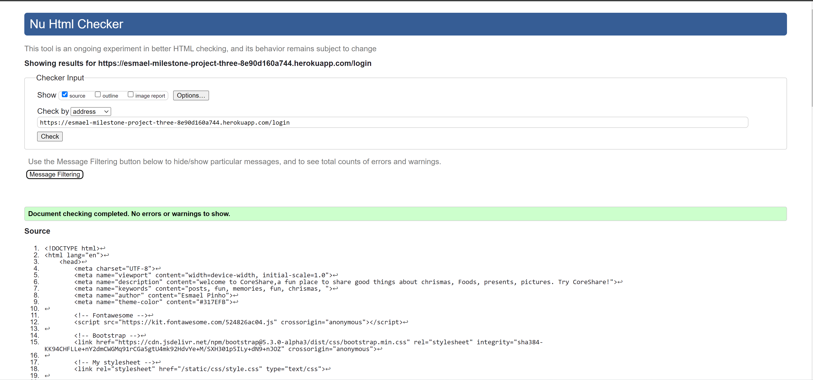 |  | 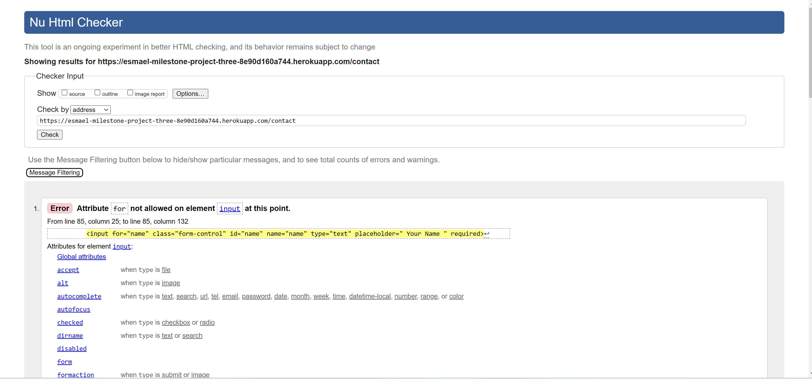 | 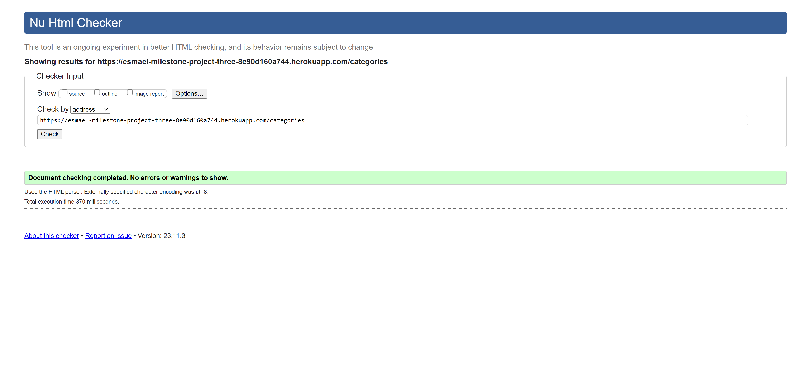 | 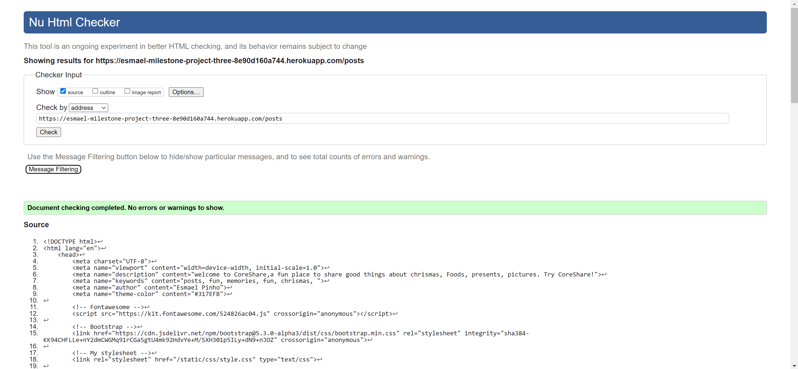 |
|* No issues found |* No issues found |* No issues found |* No issues found |* No issues found |* No issues found |
---
- Add/Edit pages and Css

| **Add_category** | **Edit_category** | **Add_post** | **Edit_post** | **Css** |
|------------------|-------------------|--------------|---------------|---------|
| 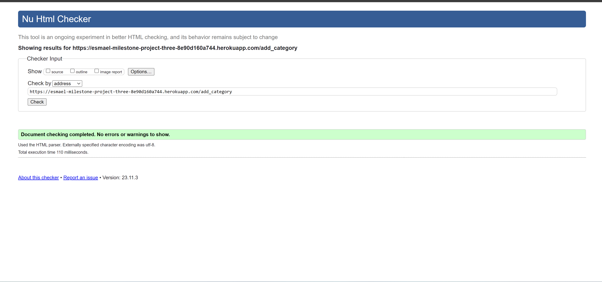 |  |  |  | 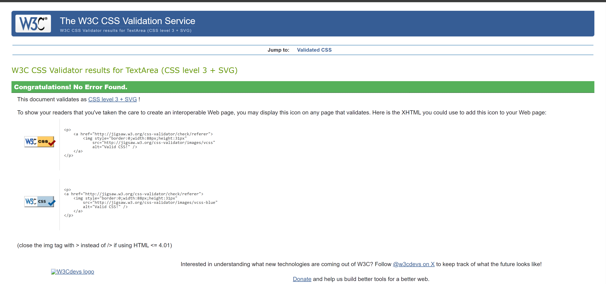 |
|* No issues found  |* No issues found  |* No issues found  |* No issues found  |* No issues found |


### JShint

| **Script.js** | **Email.js** |
|---------------|--------------|
| 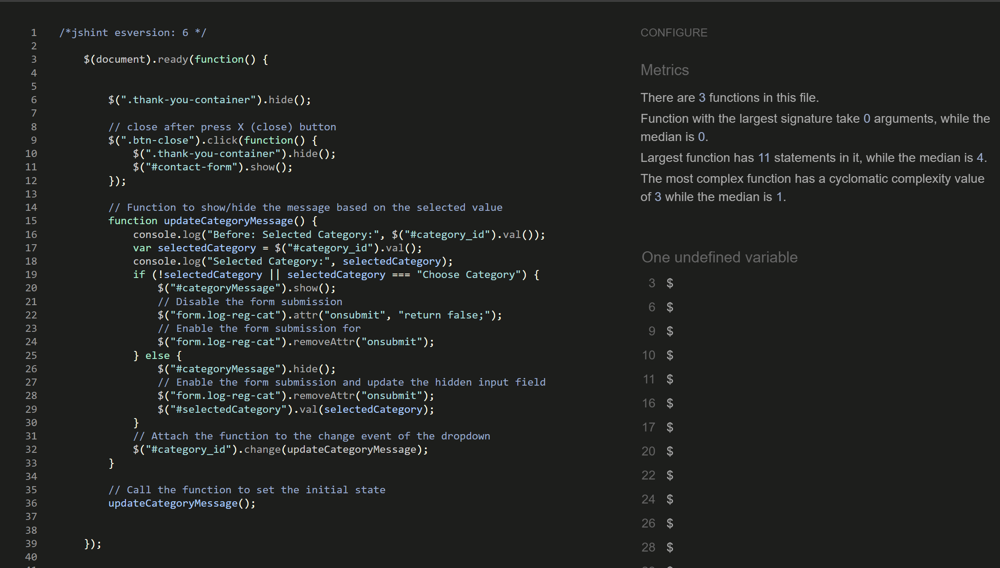 | 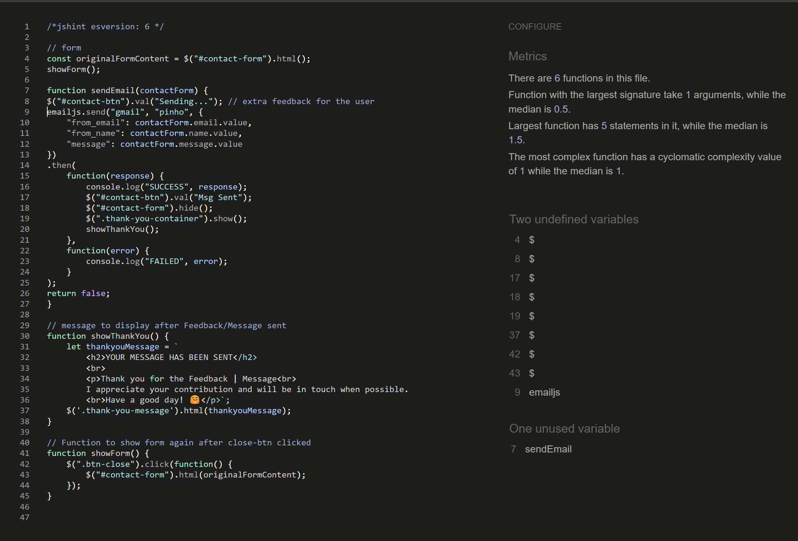 |
|* Warning: 1 undefined variables -$- . It kept saying that the jquery symbol was undefined, I did search as to why that could be but couldn't find any reason. |* Warnings: 2 undefined variables -$- and emailjs, but sendEmail is link on the base page. |


# Deployment

## Creating a Gitpod Workspace

The project was created in Gitpod using the Code Institute Gitpod Full Template using these steps:

1. Log in to GitHub and go to the [Code Institute student template for Gitpod](https://github.com/Code-Institute-Org/gitpod-full-template)
2. Click 'Use this Template' next to the Green Gitpod button.
3. Add a repository name and click 'Create reposiory from template'.
4. This will create a copy of the template in your own repository. Now you can click the green 'Gitpod' button to open a workspace in Gitpod.

## Forking the GitHub Repository

Forks are used to propose changes to someone else's project or to use someone else's project as a starting point for your own idea. By forking the GitHub Repository you make a copy of the original repository on our GitHub account to view and/or make changes without affecting the original repository.

To Fork a Github Repository:

1. Log in to GitHub and go to the [GitHub Repository](https://github.com/Esmael-Pinho/Third-Milestone-Project)
2. Locate the Fork button in the top-right corner of the page, click Fork.
3. You should now have a copy of the original repository in your GitHub account.

## Making a Local Clone

You will now have a fork of the repository, but you don't have the files in that repository locally on your computer.

To make a local clone:

1. Log in to GitHub and go to the [GitHub Repository](https://github.com/Esmael-Pinho/Third-Milestone-Project)
2. Above the list of files, click  Code.
3. To clone the repository using HTTPS, under "Clone with HTTPS", click the 'Copy' icon. To clone the repository using an SSH key, including a certificate issued by your organization's SSH certificate authority, click Use SSH, then click the 'Copy' icon. To clone a repository using GitHub CLI, click Use GitHub CLI, then click the 'Copy' icon.
4. Open Git Bash.
5. Change the current working directory to the location where you want the cloned directory.
6. Type git clone, and then paste the URL you copied earlier. It will look like this, with your GitHub AE username instead of YOUR-USERNAME:

```
$ git clone https://github.com/YOUR-USERNAME/YOUR-REPOSITORY
```

7. Press Enter. Your local clone will be created.

```
$ git clone https://github.com/YOUR-USERNAME/YOUR-REPOSITORY
> Cloning into `Third-Milestone-project`...
> remote: Counting objects: 10, done.
> remote: Compressing objects: 100% (8/8), done.
> remove: Total 10 (delta 1), reused 10 (delta 1)
> Unpacking objects: 100% (10/10), done.
```

## Creating an application with Heroku

You will need to deploy the application using Heroku.

1. Create a requirements.txt file by typing ``` pip3 freeze --local > requirements.txt ``` into the Gitpod CLI. Ensure this is added to your .gitignore file.
2. Create a Procfile by typing ```echo web: python app.py > Procfile```. Open it and ensure it doesn't have a new line, as this can create errors. Ensure it starts with a capital P.
3. Add and commit these files to Github.
4. Go to [Heroku](https://dashboard.heroku.com/apps). Log in or create an account
5. Click the 'New' button and click 'Create new app'.
6. Enter a unique name for your project with no capital letters or spaces and select your region. Click 'Create App'.
7. Inside your project, go to the Resources tab and create a Heroku Postgres Database
8. Inside your project, go to the 'Settings' tab. Scroll down and click 'Reveal Config Vars'.
9. Add in the following variables
  - IP : 0.0.0.0
  - PORT : 5000
  
  - SECRET_KEY : Your_secret_key
10. Deploy your project by going to the Deploy tab and choose 'Connect to Github'
11. Find your repository name and select Connect.
12. To connect your Heroku database, go to 'More' in the top right and select run console. Enter ```python3``` to access the python intepreter.
13. Then type ```From coreshare import db```. Then type ```db.create_all()```. You can then exit the console.

# Credits

## Code - Content

- [Bootstrap](https://getbootstrap.com/docs/5.3/layout/containers/): I used this library throughout the project. Particularly for the nav bar, cards, forms and buttons.

- [W3Schools](https://www.w3schools.com/sql/default.asp): I referred to guides.
- [Youtube](https://www.youtube.com/) and guides on how to database errors, as I had a few issues when trying to deploy to [Heroku](https://dashboard.heroku.com/).
- [CodeInstitute walkthrough relational database](https://learn.codeinstitute.net/courses/course-v1:CodeInstitute+DIWADRDB+2022_Q3/courseware/c0c31790fcf540539fd2bd3678b12406/6e44128b0b37416ab40c1a87ef2cb32a/) Used the lessons, a multiple couple of times, as I got super confused, with few topcs.
- [Pexels](https://www.pexels.com) and [Google images](https://images.google.co.uk/), so some of the images as well as the default one.
- Email.js: [Code Institute emailJs walkthrough project](https://learn.codeinstitute.net/courses/course-v1:CodeInstitute+IFD101+2017_T3/courseware/03d3f6524ad249d9b33e3336d156dfd0/e4710f80cdf34bffbd607bc102482d5c/?child=first)


## Acknowledgements
I need to highlight the tutor support team, as for this project, at least for half a dozen times, I had issues, weirdly all mostly regarding deploying to heroku as there were always issues. But all as always sorted. Especially today, almost 4hours trying just to sort the heroku deployment.  Thank-you !


Please note this is a personal project. This website is purely for the sake of the developer's portfolio and not for public consumption.

Esmael Pinho, 2023.